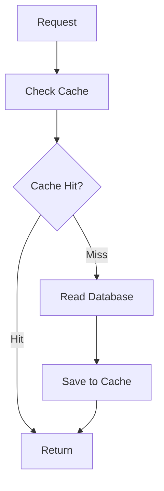
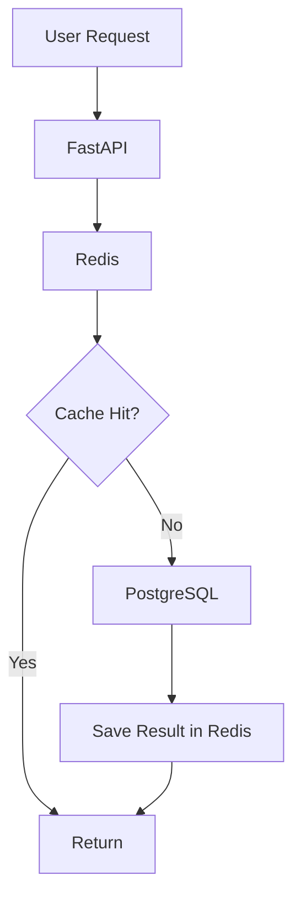
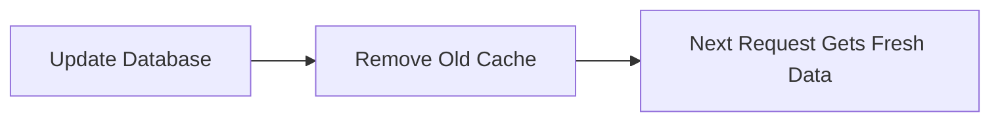
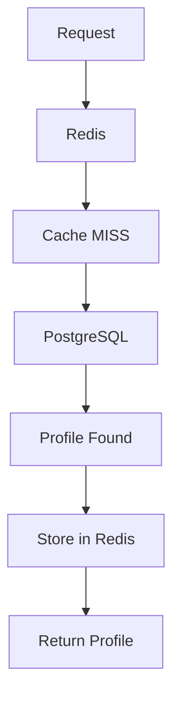
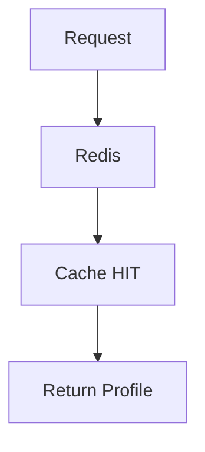
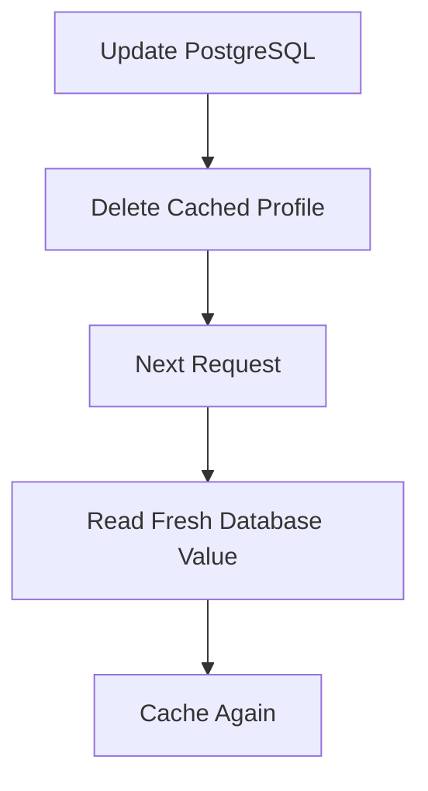
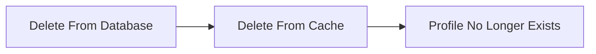
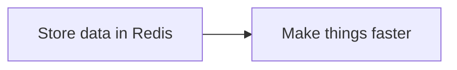
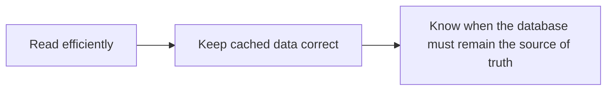
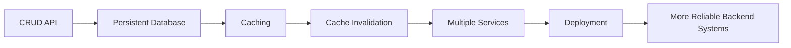

# ProfileCache API

A backend project built to understand one important question:

**What should happen when the same data is requested again and again?**

Instead of treating this as another CRUD application, I used the project to learn how caching can make repeated reads faster while still keeping the data correct.

---

## Why I Built This

A normal API can read a user profile directly from the database every time it is requested.

That works.

But if the same profile is requested repeatedly, asking the database for the same information every time is unnecessary.

So this project introduces a cache between the application and the database.

The main idea is simple:



The interesting part was not simply making reads faster.

The real challenge was making sure the cached data **never became stale after an update or delete**.

That is what made this project useful.

---

## The Main Idea — Cache Aside

The application follows a simple rule:

**Check the cache first. Use the database when needed.**

For a profile request:



When a profile changes:



This keeps performance and correctness working together.

---

## What the Project Can Do

- Create user profiles
- Retrieve all profiles
- Retrieve a single profile
- Cache frequently requested profiles
- Update part of a profile
- Delete profiles
- Automatically expire cached entries
- Remove stale cache after updates and deletes
- Run the application as multiple connected services
- Apply database migrations safely

---

## What Happens During a Read?

Imagine a user requests:

```text
/users/10
```

### First request

Redis does not have the profile yet.



### Next request



The second request avoids another database read.

---

## What Happens During an Update?

Caching introduces an important problem.

Suppose Redis contains:

```text
Name: Alex
Age: 21
```

Then the database is updated to:

```text
Name: Alex
Age: 22
```

If the cached version stays untouched, users may continue receiving the old value.

So after an update:



This is **cache invalidation**.

It was one of the most important ideas I wanted to understand through this project.

---

## What Happens During a Delete?

The same rule applies when a profile is deleted.



The cache should never behave as though deleted data still exists.

---

## API Overview


---

## What I Learned

This project changed how I think about caching.

Before building it, caching looked like:



After building it, the real idea became:



The important lesson was:

**Performance is useful only when correctness is preserved.**

---

## Why This Project Matters

This project was one of my first steps from building simple CRUD applications toward thinking about how backend systems behave as a whole.

It introduced several questions that matter in larger systems:

- Where should data come from?
- What happens when cached data becomes old?
- Which system is the source of truth?
- When should cached information expire?
- What should happen after an update or delete?
- How should multiple services communicate?

Understanding those questions became more valuable than simply learning another library.

---

## Project Progression



This project became an important foundation for the more complex backend and AI systems I started building afterward.

---

## Running the Project

### 1. Clone the repository

```bash
git clone https://github.com/imLeo007/user-profile-cache-api.git
cd user-profile-cache-api
```

### 2. Configure the environment

Create a `.env` file with the database and Redis configuration expected by the application.

### 3. Build and start the services

```bash
docker compose up --build
```

This starts FastAPI, PostgreSQL, and Redis as connected services.

### 4. Run database migrations

```bash
docker compose exec api alembic upgrade head
```

### 5. Open Swagger UI

```text
http://localhost:8000/docs
```

### 6. Try the cache-aside flow

Create a user profile, retrieve it once to populate Redis, and retrieve it again to observe the cached read path. Update or delete the profile to exercise cache invalidation.

### 7. Open the live API

```text
https://user-profile-cache-api.onrender.com/docs
```

---

## Final Note

The purpose of this repository is not to demonstrate a complicated product.

It is to demonstrate a simple backend idea **properly**:

> Keep frequently requested data close to the application, keep the database as the source of truth, and make sure the two never disagree.

That principle looks simple on paper.

Building it made me understand why it matters.

---

## Links

**GitHub:**  
https://github.com/imLeo007/user-profile-cache-api

**Live API:**  
https://user-profile-cache-api.onrender.com/docs